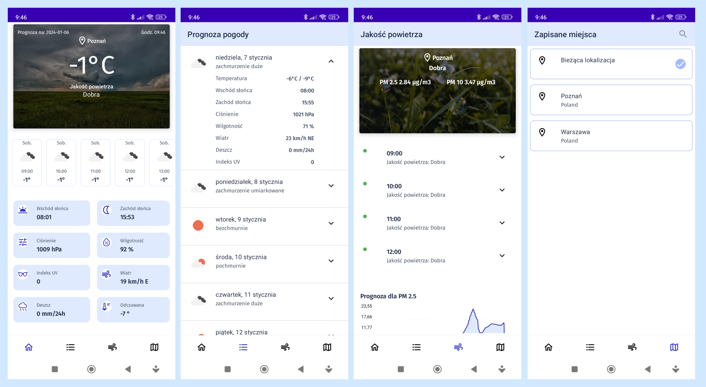

## Weather : Weather Forecasting App written in Jetpack Compose

### Screenshots

### Features

- Current Weather
- Hourly Weather
- Daily Weather
- Air Quality
- Search City
- Favorite Cities
- Weather at current location
- Support for different screen sizes
- Light/Dark Mode
- Animations

### Used libs

- Material3
- Jetpack Compose
- Kotlin Coroutines
- MVVM Architecture
- Hilt
- DataStore
- Location
- Retrofit
- Room
- Navigation Component
- Coil
- Accompanist
- Charts